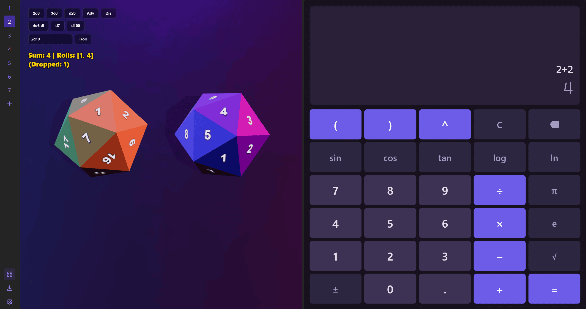
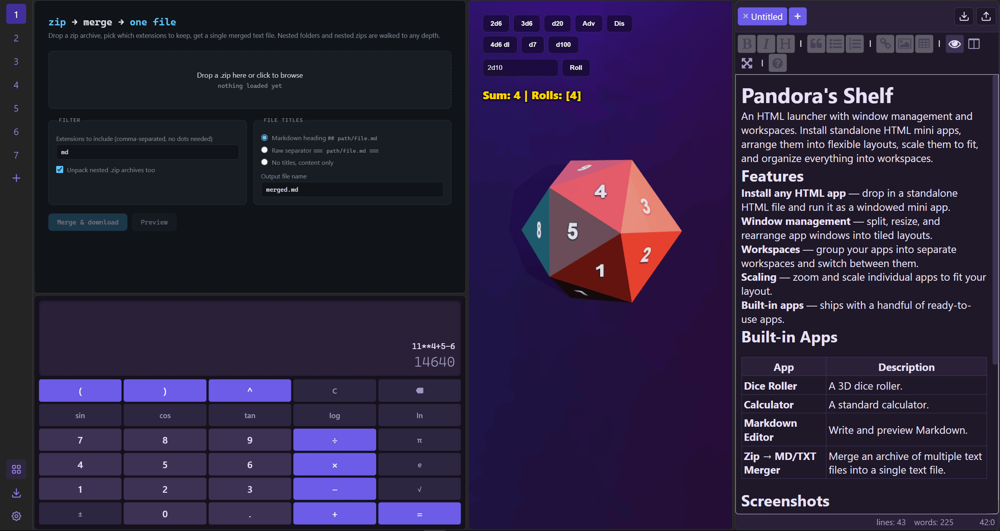
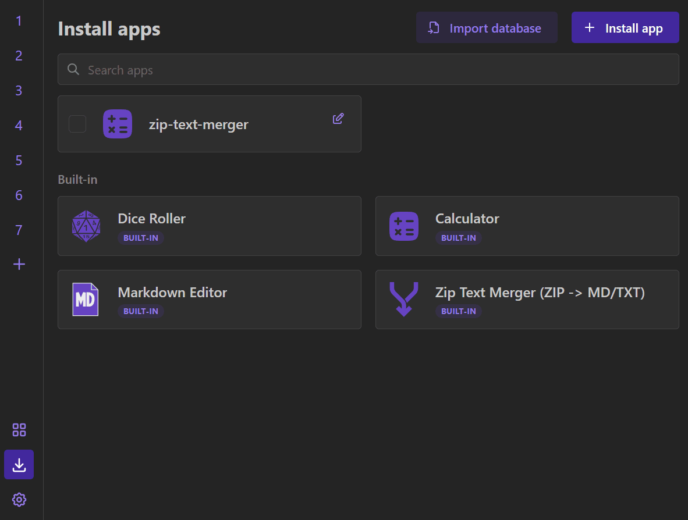
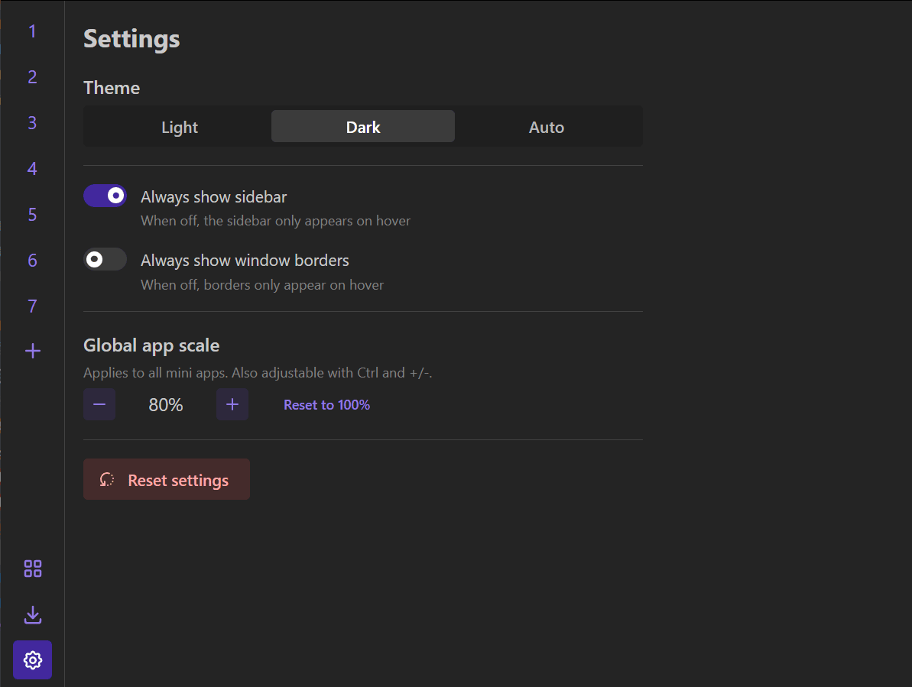

<h1 style="display: flex; align-items: center;">
   Pandora's Shelf
</h1>

An HTML launcher with window management and workspaces. Install standalone HTML mini apps, arrange them into flexible layouts, scale them to fit, and organize everything into workspaces.

## Features

- **Install any HTML app** — drop in a standalone HTML file and run it as a windowed mini app.
- **Window management** — split, resize, and rearrange app windows into tiled layouts.
- **Workspaces** — group your apps into separate workspaces and switch between them.
- **Scaling** — zoom and scale individual apps to fit your layout.
- **Built-in apps** — ships with a handful of ready-to-use apps.

## Built-in Apps

| App                     | Description                                                      |
| ----------------------- | ---------------------------------------------------------------- |
| **Dice Roller**         | A 3D dice roller.                                                |
| **Calculator**          | A standard calculator.                                           |
| **Markdown Editor**     | Write and preview Markdown.                                      |
| **Zip → MD/TXT Merger** | Merge an archive of multiple text files into a single text file. |

## Get Pandora's Shelf

- **Try it online** — [online demo](https://woundedlands.github.io/Pandoras-Shelf/), no install needed.
- **Download** — [Releases page](https://github.com/woundedlands/Pandoras-Shelf/releases).

## Screenshots

## License

See [LICENSE](LICENSE).
